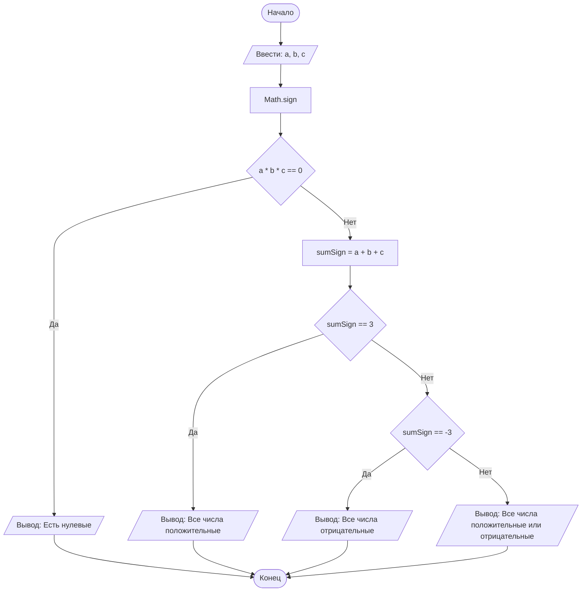

## Отчет по лабораторной работе № 1

#### № группы: `ПМ-2401`

#### Выполнил: `Асеев Егор Артурович`

#### Вариант: `2`

### Cодержание:

- [Постановка задачи](#1-постановка-задачи)
- [Входные и выходные данные](#2-входные-и-выходные-данные)
- [Выбор структуры данных](#3-выбор-структуры-данных)
- [Алгоритм](#4-алгоритм)
- [Программа](#5-программа)
- [Анализ правильности решения](#6-анализ-правильности-решения)

### 1. Постановка задачи

> На вход программы подаются три целых числа A, B, C. Необходимо вывести одно из следующих сообщений в зависимости от значений чисел:\
• «Все числа положительные», если все три числа больше нуля.\
• «Все числа отрицательные», если все три числа меньше нуля.\
• «Все числа положительные или отрицательные», если среди чисел
есть как положительные, так и отрицательные.\
• «Есть нулевые», если хотя бы одно из чисел равно нулю.

Нужно проверить, есть ли среди введённых чисел нулевые если есть - вывести "Есть нулевые".
Если все три числа не нулевые - проверить, есть ли среди них положительные и есть ли среди них отрицательные.  
Если есть только положительные - вывести "Все числа положительные".
Если есть только отрицательные - вывести "Все числа отрицательные".  
Если есть и отрицательные и положительные - вывести "Все числа положительные или отрицательные".

Всего 4 варианта. 

### 2. Входные и выходные данные

#### Данные на вход

На вход программа должна получать 3 целых числа

|             | Тип         | min значение    | max значение     |
|-------------|-------------|-----------------|------------------|
| A (Число 1) | Целое число | -2<sup>63</sup> | 2<sup>63</sup>-1 |
| B (Число 2) | Целое число | -2<sup>63</sup> | 2<sup>63</sup>-1 |
| С (Число 3) | Целое число | -2<sup>63</sup> | 2<sup>63</sup>-1 |
#### Данные на выход

Программа выводит одну из сторок:  
«Все числа положительные»,  
«Все числа отрицательные»,  
«Все числа положительные или отрицательные»,  
«Есть нулевые»

|          | Тип    |
|----------|--------|
| Строка 1 | Строка |

### 3. Выбор структуры данных

Поскольку в данной задаче достаточно хранить только знаки чисел `A`, `B` и `C`, 
можно хранить в трёх переменных -1, если число отрицательное, 
0, если число равно нулю и 1, если число положительное.
Также задана переменная `sumSign` для того, чтобы не суммировать `a`, `b` и `c` каждый раз отдельно
и для того, чтобы проводить меньше операций сравнения

|                  | название переменной | Тип (в Java) | 
|------------------|---------------------|--------------|
| Знак A (Число 1) | `a`                 | `int`        |
| Знак B (Число 2) | `b`                 | `int`        | 
| Знак C (Число 2) | `c`                 | `int`        | 
| `a` + `b` + `c`  | `sumSign`           | `int`        | 


### 4. Алгоритм

#### Алгоритм выполнения программы:

1. **Ввод данных:**  
   Программа считывает три целых числа 
   и записывает в соответствующие переменные (`a`, `b`, `c`) результат `Math.signum()` от этих чисел.

2. **Сравнение чисел с нулём:**  
   Программа проверяет, равно ли произведение `a`, `b`, `c` нулю. 
   Если равно (значит хотя бы одно из чисел `A`, `B`, `C` равно нулю) выводит "Есть нулевые".

3. **Задание переменной `sumSign`:**  
   Если произведение `a`, `b`, `c` не равно нулю, задаёт переменную `sumSign` равную сумме `a`, `b` и `c`.
   (С помощью неё далее будет удобнее проводить сравнения)  

4. **Сравнение `sumSign` с `3`:**  
   Если `sumSign` равно `3` (значит все три входных числа положительные), программа выводит: "Все числа положительные".

5. **Сравнение `sumSign` с `-3`:**  
   Если `sumSign` равен `-3` (значит все три входных числа отрицательные), программа выводит: "Все числа отрицательные".

6. **Вывод результата:**
   Если `sumSign` не равен ни `3`, ни `-3` 
   (значит среди входных данных есть как отрицательные, так и положительные числа), 
   программа выводит: "Все числа положительные или отрицательные"

#### Блок-схема



### 5. Программа

```java
import java.io.PrintStream;
import java.util.Scanner;
public class Main {
    // Объявляем объект класса Scanner для ввода данных
    public static Scanner in = new Scanner(System.in);
    // Объявляем объект класса PrintStream для вывода данных
    public static PrintStream out = System.out;
    
    public static void main(String[] args) {
        // считывание знаков трёх чисел
        int a = (int)Math.signum(in.nextLong()), b = (int)Math.signum(in.nextLong()), c = (int)Math.signum(in.nextLong());

        // произведение a, b и c даст 0 только если хотя бы одно из данных чисел равно 0
        // (проверка на 0 среди данных чисел)
        if (a * b * c == 0)
            out.print("Есть нулевые"); // Вывод ответа
        else {
            // если среди данных чисел нет 0 создаётся переменная, равная сумме "знаков" данных чисел
            int sumSign = a + b + c;
            
            // sumSign равна 3 только если все данные переменные были положительными
            if(sumSign == 3)
                out.print("Все числа положительные"); // Вывод ответа
            else {
                // если не все данные числа положительные и ни одно из них не равно 0
                // sumSign равно -3 только если все данные числа отрицательные
                if (sumSign == -3)
                    out.print("Все числа отрицательные"); // Вывод ответа
                else // если среди данных чисел нет равных 0,
                     // не все числа отрицательные и не все положительные,
                     // значит среди чисел есть и положительные и отрицательные
                    out.print("Все числа положительные или отрицательные"); // Вывод ответа
            }
        }
    }
}
```

### 6. Анализ правильности решения

Программа работает корректно на всем множестве решений с учетом ограничений.

1. Тест для `A > 0, B > 0, C > 0`:

    - **Input**:
        ```
        1 2 3
        ```

    - **Output**:
        ```
        Все числа положительные
        ```

2. Тест для `A * B * C == 0`:

    - **Input**:
        ```
        5 0 20
        ```

    - **Output**:
        ```
        Есть нулевые
        ```

3. Тест для `A < 0, B < 0, C < 0`:

    - **Input**:
        ```
        -10 -20 -30
        ```

    - **Output**:
        ```
        Все числа отрицательные
        ```

4. Тест: среди `A, B, C` Есть и положительные числа и отрицательные:

    - **Input**:
        ```
        30 -5 42
        ```

    - **Output**:
        ```
        Все числа положительные или отрицательные
        ```

5. Тест на граничных значениях:

    - **Input**:
        ```
        9223372036854775807 5 -9223372036854775808
        ```

    - **Output**:
        ```
        Все числа положительные или отрицательные
        ```
